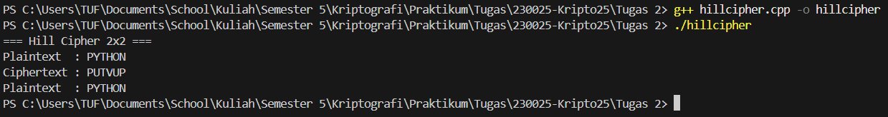

# Hill Cipher 2x2

## Deskripsi Program
Program ini mengimplementasikan **Hill Cipher** dengan matriks kunci 2x2 untuk **enkripsi** dan **dekripsi** teks. Hill Cipher adalah algoritma kriptografi klasik berbasis **matriks linear**.  

- **Enkripsi:** Mengubah plaintext menjadi ciphertext menggunakan matriks kunci.
- **Dekripsi:** Mengembalikan ciphertext menjadi plaintext menggunakan invers matriks kunci modulo 26.  

Program ini hanya mendukung **huruf kapital A–Z** dan plaintext dengan panjang genap.  

## Alur Program
1. Program mendefinisikan matriks kunci `2x2` dan teks awal (`plaintext`) serta `ciphertext` contoh.  
2. Fungsi **encrypt**:
   - Mengubah setiap dua huruf plaintext menjadi vektor.
   - Mengalikan dengan matriks kunci dan mengambil hasil modulo 26.
   - Menggabungkan hasil menjadi ciphertext.
3. Fungsi **decrypt**:
   - Menghitung determinan matriks kunci dan invers modulo 26.
   - Membuat matriks invers kunci.
   - Mengalikan ciphertext dengan matriks invers untuk mendapatkan plaintext asli.
4. Hasil enkripsi dan dekripsi ditampilkan di console.

## Cara Menjalankan
1. Compile program:
   ```bash
   g++ hillcipher.cpp -o hillcipher

## Output

