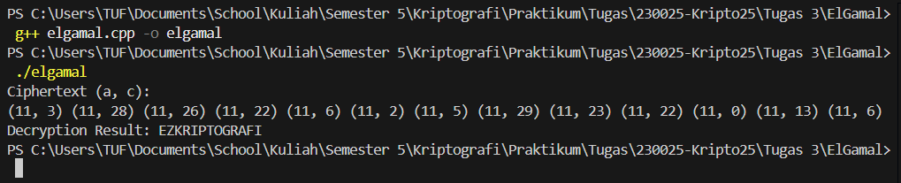

# ElGamal Cryptosystem

## Deskripsi Program
Program ini mengimplementasikan **ElGamal Cryptosystem**, yaitu algoritma kriptografi **kunci publik** yang menggunakan operasi **perpangkatan modulo bilangan prima** untuk proses **enkripsi** dan **dekripsi** pesan.

- **Enkripsi:** Mengubah plaintext menjadi pasangan ciphertext `(a, c)`.
- **Dekripsi:** Mengembalikan ciphertext menjadi plaintext menggunakan kunci privat.

Program ini menggunakan plaintext berupa **huruf kapital A–Z** yang dikonversi ke dalam bentuk numerik.

## Alur Program
1. Program mendefinisikan parameter kriptografi:
   - Bilangan prima `p`
   - Generator `g`
   - Kunci privat `x`
   - Kunci sementara `k`
2. Program membentuk **kunci publik** menggunakan rumus:
   ```
   y = g^x mod p
   ```
3. Proses **enkripsi**:
   - Menghitung:
     ```
     a = g^k mod p
     b = y^k mod p
     ```
   - Menghasilkan ciphertext dengan rumus:
     ```
     c = (m × b) mod p
     ```
   - Ciphertext direpresentasikan sebagai pasangan `(a, c)`.
4. Proses **dekripsi**:
   - Menghitung:
     ```
     s = a^x mod p
     ```
   - Menentukan invers modulo dari `s`.
   - Mengembalikan plaintext dengan rumus:
     ```
     m = (c × s⁻¹) mod p
     ```
5. Hasil enkripsi dan dekripsi ditampilkan di console.

## Cara Menjalankan
1. Compile program:
   ```bash
   g++ elgamal.cpp -o elgamal
   ```
2. Jalankan program:
   ```bash
   ./elgamal
   ```

## Output

