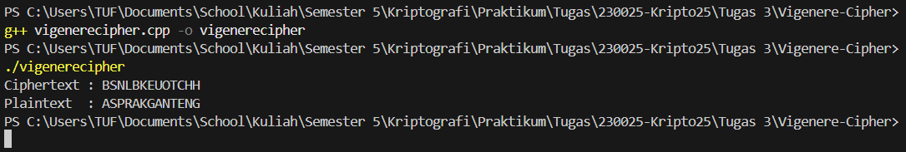

# Vigenere Cipher

## Deskripsi Program
Program ini mengimplementasikan **Vigenere Cipher** untuk proses **enkripsi** dan **dekripsi** teks.  
Vigenere Cipher merupakan algoritma kriptografi klasik berbasis **substitusi polialfabetik** yang menggunakan sebuah **kata kunci (key)**.

- **Enkripsi:** Mengubah plaintext menjadi ciphertext dengan menjumlahkan nilai huruf plaintext dan key.
- **Dekripsi:** Mengembalikan ciphertext menjadi plaintext dengan mengurangkan nilai key.

Program ini hanya mendukung **huruf kapital A–Z** dan tidak memproses karakter selain alfabet.

## Alur Program
1. Program mendefinisikan teks awal (`plaintext`) dan kata kunci (`key`).
2. Fungsi **enkripsi**:
   - Mengonversi setiap huruf plaintext dan key ke nilai numerik (A = 0, B = 1, …, Z = 25).
   - Menggunakan rumus:
     ```
     C = (P + K) mod 26
     ```
   - Menggabungkan hasil perhitungan menjadi ciphertext.
3. Fungsi **dekripsi**:
   - Menggunakan rumus:
     ```
     P = (C - K + 26) mod 26
     ```
   - Mengembalikan ciphertext menjadi plaintext awal.
4. Hasil enkripsi dan dekripsi ditampilkan di console.

## Cara Menjalankan
1. Compile program:
   ```bash
   g++ vigenerecipher.cpp -o vigenerecipher
   ```
2. Jalankan program:
   ```bash
   ./vigenerecipher
   ```

## Output

